## Introduction

As a software engineer who spends countless hours typing, both at work and home, I began experiencing soreness in my fingers—especially my pinky, from constantly pressing Ctrl and Shift. You know, the daily grind of copying code that's already been copied by someone else (just kidding… kind of). 

Being a bit of a hypochondriac and wanting to safeguard my hands for years of coding ahead, I started researching ergonomic keyboards. That's when I stumbled upon the [ZSA Moonlander Mark I](https://www.zsa.io/moonlander):

  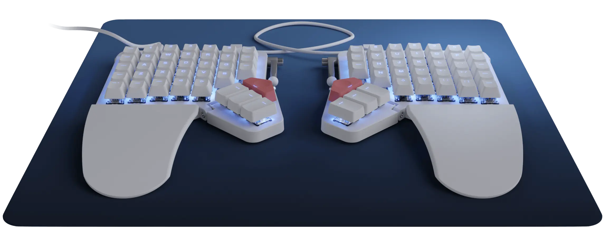

This keyboard is something else! It's an ortholinear split keyboard, meaning it's split into two halves that can be angled to match the natural position of your wrists and arms. This design reduces strain and promotes healthier typing posture. Say goodbye to wrist pain, carpal tunnel syndrome, and repetitive strain injuries (RSIs)!

## Staggered vs. Ortholinear Keyboards

Before diving deeper, let's clarify some terms. "Staggered" refers to the traditional key arrangement we're all familiar with—vertically aligned keys in each column, but horizontally staggered rows. This layout dates back to typewriters, where staggered rows prevented the key arms from jamming when multiple keys were pressed simultaneously.

On the other hand, an "ortholinear" keyboard has keys aligned both vertically and horizontally, creating a perfect grid pattern. This layout, sometimes called a "matrix" layout, offers a more ergonomic typing experience, especially for those prone to strain from traditional keyboards.

  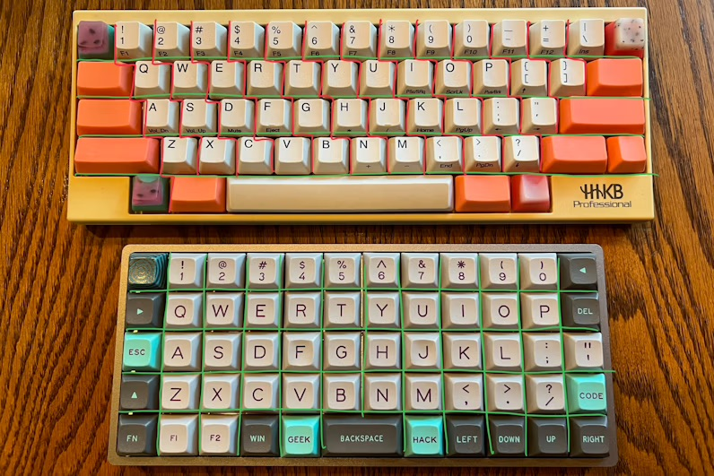

_Image Credit: @HoffmanMyster_

If you're interested in learning more about keyboard layouts, I recommend [this YouTube video](https://youtu.be/188fipF-i5I?si=3mTObSbMrnhZTDnX).

Despite my excitement about the [ZSA Moonlander Mark I](https://www.zsa.io/moonlander), its price was a major deterrent—especially for something I wasn't sure I'd get used to. That's when I discovered the DIY mechanical keyboard community, where hardware and software are open-source, offering endless possibilities.

## My Exploration of DIY Mechanical Keyboards

I began with the [Lily58 Pro](https://github.com/kata0510/Lily58):

  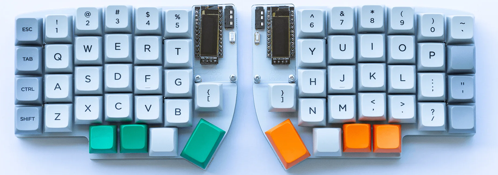

This 6×4+4 keys column-staggered split keyboard was a promising start. However, I soon learned about the power of customizable layers in keyboard layouts. Layers allow keys to perform different functions depending on the context, similar to how we use Shift or Alt keys. Intrigued by the potential to simplify my setup, I decided to explore smaller and more customizable options.

That's when I found the [Corne Keyboard](https://github.com/foostan/crkbd):

  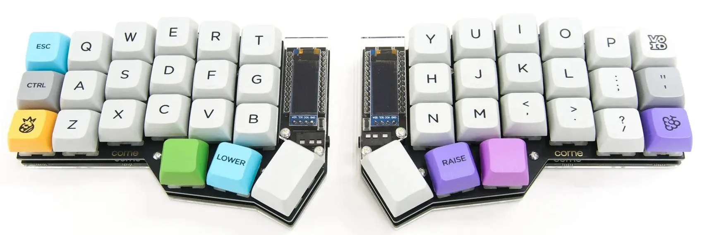

The [Corne Keyboard](https://github.com/foostan/crkbd) is a split keyboard with 3x6 column-staggered keys and 3 thumb keys. In its latest iteration, you can even break the outer column, making it a 3x5 layout. But as I delved deeper into the rabbit hole of DIY keyboards, I discovered even more compact designs.

Enter the [Ferris Keyboard](https://github.com/pierrechevalier83/ferris):

  

Named after the Rustlang mascot, Ferris, this keyboard instantly won my heart. However, one drawback was that the microcontroller was soldered in, limiting customization. Fortunately, [David Barr](https://github.com/davidphilipbarr) built upon Ferris to create [Sweep](https://github.com/davidphilipbarr/Sweep):

  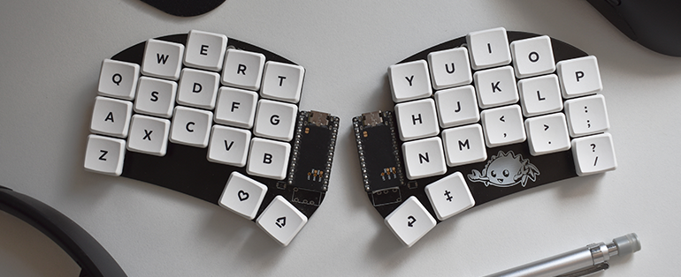

The [Sweep](https://github.com/davidphilipbarr/Sweep) is a version of the Ferris that uses a daughterboard like a Promicro, Elite-C, Bit-C, or Nice!Nano instead of onboard components. There are even more alternatives, such as the [Urchin](https://github.com/duckyb/urchin) and [Swoop](https://github.com/jimmerricks/swoop), which add features like displays, encoders, and LEDs. I ultimately chose the [Sweep Bling MX](https://github.com/davidphilipbarr/Sweep) for its simplicity and flexibility, allowing for both wired and wireless use.

## The Build Process: Hardware

I started by ordering the PCBs from JLCPCB using the files provided [here](https://github.com/davidphilipbarr/Sweep/tree/main/Sweep%20Bling%20MX). Next, I sourced all the components from AliExpress as listed in the [repository](https://github.com/davidphilipbarr/Sweep).

Once everything arrived:

  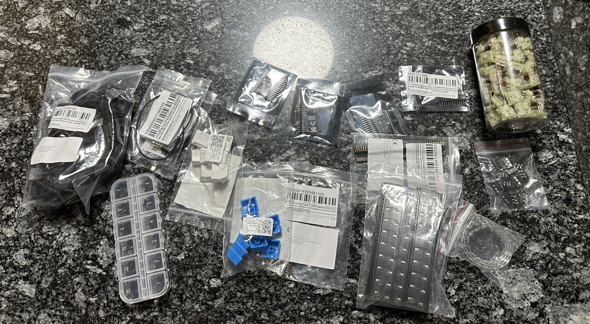

I began assembling the keyboard. Soldering was the next step:

  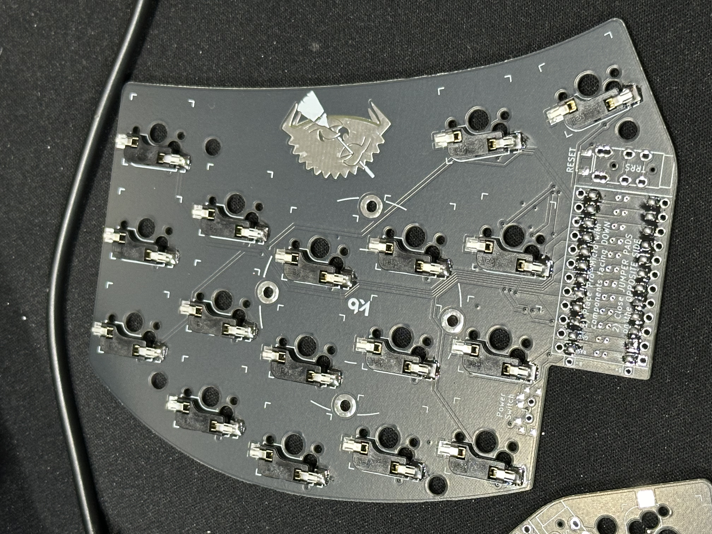

I quickly realized that the header I used was too small, so I replaced it. I also built two keyboards—one with the MCU components facing down, and the other facing up, depending on how you solder the jumpers on the board. Always read the instructions carefully!

  

### The Case

For the case, I used [Sweep Bling MX Sleeve Hard Case](https://www.printables.com/model/337694-sweep-bling-mx-sleeve-hard-case) and made the following modifications:

- **PCB Snap-In Feature**: Redesigned the interior to securely snap the PCB into place, ensuring a snug fit without the need for additional adhesives or screws.
- **Enhanced Power Button Space**: Enlarged the power button area to allow for easier access and a more comfortable user experience.

These enhancements improve the overall functionality and ease of use while maintaining the sleek design of the original model. You can see the end result [here](https://makerworld.com/en/models/605296#profileId-528057).

  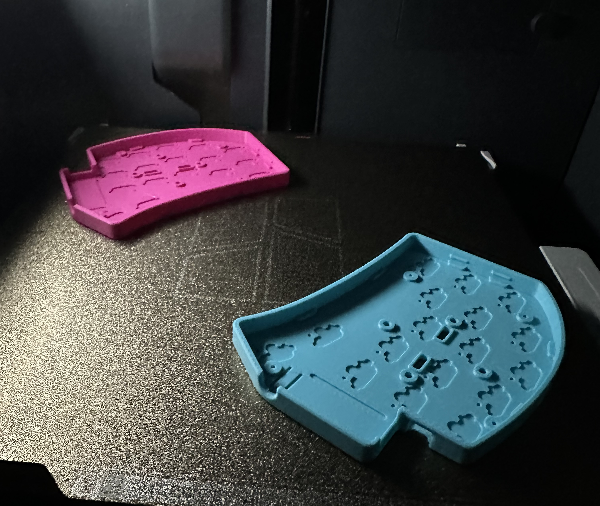

## The Build Process: Software

Flashing the firmware was more challenging than expected, mainly due to write protection on the SuperMini boards. I documented my solution in [this blog post](https://jmarcelomb.github.io/blog/posts/1/) to save you the time I spent troubleshooting.

For firmware, you can choose between [QMK](https://qmk.fm/) and [ZMK](https://zmk.dev/). QMK is great for wired keyboards with deep customization, while ZMK is optimized for wireless keyboards and power efficiency. Since I wanted a wireless build, I went with [ZMK](https://zmk.dev/).

I chose the [Miryoku](https://github.com/manna-harbour/miryoku/) layout, which is ergonomic, minimal, orthogonal, and universal. I forked the [Miryoku ZMK](https://github.com/manna-harbour/miryoku_zmk), added a [build-sweep-nice_nano_v2.yml](https://github.com/jmarcelomb/miryoku_zmk/blob/master/.github/workflows/build-sweep-nice_nano_v2.yml) file, and created a [custom_config.h](https://github.com/jmarcelomb/miryoku_zmk/blob/master/miryoku/custom_config.h). To enable custom combos, I added [custom_combos.dtsi](https://github.com/jmarcelomb/miryoku_zmk/blob/master/miryoku/custom_combos.dtsi). The end result is the following layout:

  

Portuguese Layout:

  

You can find a detailed explanation of how everything works [here](https://github.com/manna-harbour/miryoku/tree/master/docs/reference).

Since I was already adapting to new keyboard layouts, I explored alternatives to QWERTY, such as Dvorak and Colemak. I ultimately chose Colemak DH because it minimizes finger movement, keeping most frequently used keys on the home row.

  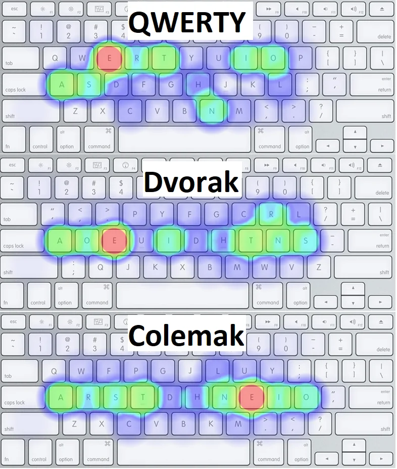

The heatmap above illustrates how the Colemak layout concentrates the most common keys under your fingertips, significantly reducing strain. Compared to Dvorak and QWERTY, Colemak offers a more efficient typing experience.

## The Final Result

In the end, I built two keyboards:

  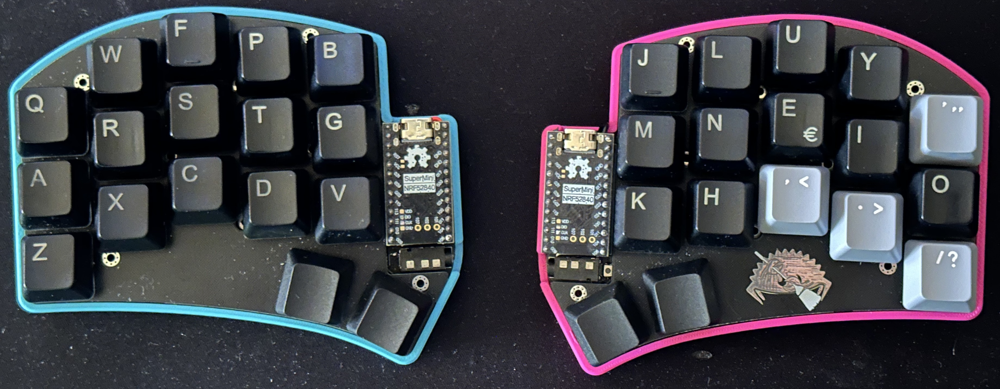

  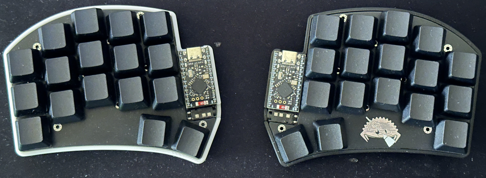

Right now, I'm daily carrying the first one and using it for work and personal tasks. It was very hard in the beginning. I went from writing over 100 words per minute to what felt like 2. I got fatigued from writing because I needed to think about where the keys were and had to look. I started using the mouse in the middle to avoid shoulder overloading and had a normal keyboard in front of the display that I used when I wanted to write fast.

I want to go without the labels on the keys eventually, but first, I need to train my muscle memory. Getting the hang of layers was fast. The problem is the new layout that I have chosen. However, I can see that I decreased my finger movements significantly, and having Shift, Ctrl, Alt, and Super in the home row is very nice.

After three weeks, I'm now writing 30 words per minute and only using this keyboard. Last week, I started putting the normal keyboard away so I don't have the instinct to use it. I don't feel as tired as I did in the beginning, and I'm starting to develop muscle memory for this keyboard, though I do make some typos due to QWERTY muscle memory. When I use a QWERTY keyboard, the 20 years of using a keyboard kick in, and it still feels natural.

The Sweep Bling MX turned out to be a fun, affordable, and educational project. Not only did I end up with a keyboard tailored to my ergonomic needs, but I also learned a lot about mechanical keyboards, electronics, and firmware.

If you're considering a DIY keyboard build, I highly recommend diving into the world of open-source keyboards. The community is incredibly supportive, and the possibilities are endless!

## Conclusion

In this journey, I learned that ergonomic keyboards are not just for enthusiasts—they can make a significant difference in your typing comfort and long-term health. If you're someone who spends a lot of time at the keyboard, it's worth exploring the world of ergonomic and custom keyboards. Your hands will thank you!

Feel free to ask anything, see you in the next post!
**jmmb**
