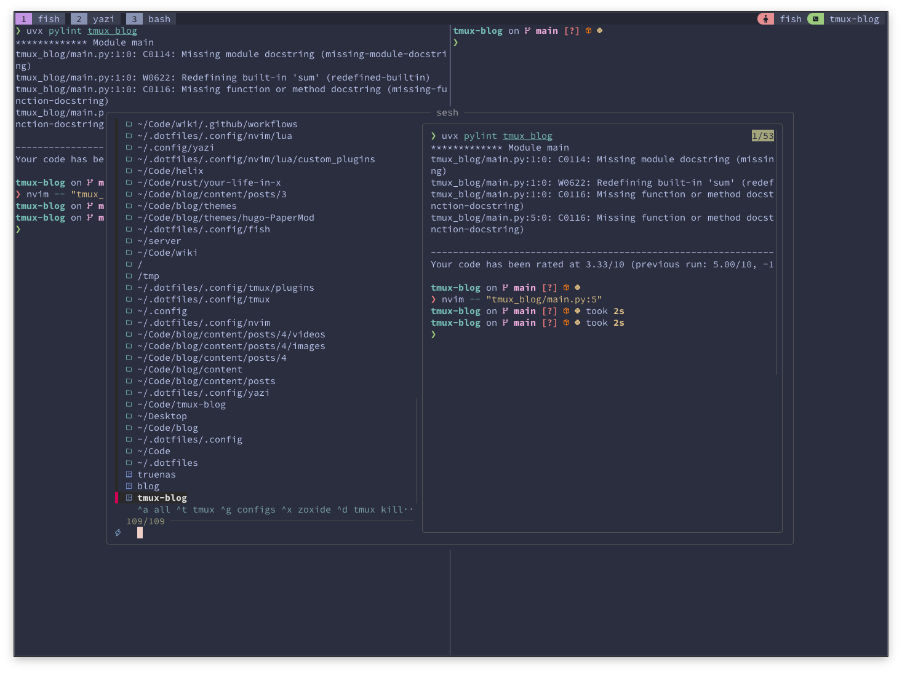

## Introduction

I used [TMux](https://github.com/tmux/tmux) in the past, however, it never stuck with me. Since I'm a Rust fan boy, I tried [Zellij](https://zellij.dev/) and I fell in love with it. It had everything that I needed and for me the best was that I didn't have to learn the shortcuts since Zellij UI has all of them. For a beginner, it was a blessing.

I used Zellij in my day-to-day work, however, I saw a youtube video that someone entering something like a VIM selection mode in the terminal copying what they need
and then continue executing CLI commands. I was intrigued, I searched and I found that terminal emulators have shortcuts to try to do something similar.
However, it doesn't feel as native, so I gave tmux a try. I saw some videos and I tried to do a config as close to zellij keybinds since I already had
the muscle memory. And then, I found tmux copy selection mode and I found my home.

Since I like tmux so much, I'm writing this tutorial on how I configured my tmux and I will highlight some of my use cases, I hope it helps someone.
Okay, you got me, I'm writing this to try to convince a friend how good it is 😅

## TL;DR

You can find my complete dotfiles at [github.com/jmarcelomb/.dotfiles](https://github.com/jmarcelomb/.dotfiles), and my tmux config specifically at [.config/tmux/tmux.conf](https://github.com/jmarcelomb/.dotfiles/blob/main/.config/tmux/tmux.conf).

<details>
<summary>Click to expand configuration</summary>

```bash
# ============================================================================
# GENERAL OPTIONS
# ============================================================================

# Mouse support and terminal settings
set -g mouse on
set -g default-terminal "tmux-256color"
set-option -sa terminal-overrides ",xterm*:Tc"
set-option -g status-position top
set -g set-clipboard on
set -g detach-on-destroy off # Don't exit from tmux when closing a session


# Window and pane numbering
set -g base-index 1                   # Start windows at 1, not 0
setw -g pane-base-index 1             # Start panes at 1, not 0
set-window-option -g pane-base-index 1
set-option -g renumber-windows on     # Renumber windows when one is closed

# Window behavior
set-option -g allow-rename off        # Don't rename windows automatically

# Enable Yazi Image Previewer
set -g allow-passthrough on
set -ga update-environment TERM
set -ga update-environment TERM_PROGRAM

# ============================================================================
# Window popups
# ============================================================================
# Popup session switcher / creator with fzf
# - shows list of sessions
# - Ctrl-K kills a session (and reloads list)
# - Enter on existing session → switch
# - Enter on query → create + switch
# - Preview pane shows windows inside the session
bind O display-popup -w 80% -h 70% -E "$HOME/.config/tmux/scripts/session-fzf.sh"

bind-key "T" run-shell "sesh connect \"$(
  sesh list --icons | fzf-tmux -p 80%,70% \
    --no-sort --ansi --border-label ' sesh ' --prompt '⚡  ' \
    --header '  ^a all ^t tmux ^g configs ^x zoxide ^d tmux kill ^f find' \
    --bind 'tab:down,btab:up' \
    --bind 'ctrl-a:change-prompt(⚡  )+reload(sesh list --icons)' \
    --bind 'ctrl-t:change-prompt(🪟  )+reload(sesh list -t --icons)' \
    --bind 'ctrl-g:change-prompt(⚙️  )+reload(sesh list -c --icons)' \
    --bind 'ctrl-x:change-prompt(📁  )+reload(sesh list -z --icons)' \
    --bind 'ctrl-f:change-prompt(🔎  )+reload(fd -H -d 2 -t d -E .Trash . ~)' \
    --bind 'ctrl-d:execute(tmux kill-session -t {2..})+change-prompt(⚡  )+reload(sesh list --icons)' \
    --preview-window 'right:55%' \
    --preview 'sesh preview {}'
)\""

bind -N "last-session (via sesh) " o run-shell "sesh last"

# Key bindings help
bind k display-popup \
    -w 90% \
    -h 100% \
    -E "tmux list-keys | fzf"

# AI Assistant popup
bind a display-popup -w 40% -h 80% -E "fish -c 'ask -i'"

# ============================================================================
# PREFIX KEY
# ============================================================================

unbind C-b
set -g prefix `
bind ` send-prefix

# ============================================================================
# KEY BINDINGS
# ============================================================================

# Configuration reload
unbind r
bind r source-file ~/.config/tmux/tmux.conf \; display-message "tmux.conf reloaded ☺️"

# Unbind Ctrl+T to let it pass through to shell
unbind C-t

# Pane splitting (open in current directory)
bind '"' split-window -v -c "#{pane_current_path}"
bind '-' split-window -v -c "#{pane_current_path}"
bind % split-window -h -c "#{pane_current_path}"
bind '|' split-window -h -c "#{pane_current_path}"

# New window in same path
bind c new-window -c "#{pane_current_path}"
bind-key S command-prompt -p "Session name:" "new-session -s '%%'"

# Window navigation
bind -n C-H previous-window
bind -n C-L next-window
bind -n M-S-Left previous-window
bind -n M-S-Right next-window

# Smart pane/window navigation with Alt + Arrow keys
# Alt + Left/Right switches panes unless at screen edge, then switches windows
bind -n M-Left if-shell "tmux display-message -p '#{pane_at_left}' | grep -q 1" "previous-window" "select-pane -L"
bind -n M-Right if-shell "tmux display-message -p '#{pane_at_right}' | grep -q 1" "next-window" "select-pane -R"
bind -n M-Up select-pane -U
bind -n M-Down select-pane -D

# Pane resizing with leader + HJKL
bind -r H resize-pane -L 5
bind -r J resize-pane -D 5
bind -r K resize-pane -U 5
bind -r L resize-pane -R 5
bind -r m resize-pane -Z # Use m key to maximize pane

# Pane resizing with leader + Arrow keys
bind -r Left resize-pane -L 5
bind -r Down resize-pane -D 5
bind -r Up resize-pane -U 5
bind -r Right resize-pane -R 5

# Window reordering
bind-key -n M-i swap-window -t -1\; select-window -t -1
bind-key -n M-o swap-window -t +1\; select-window -t +1

# ============================================================================
# VI MODE & COPY MODE
# ============================================================================

# Highlight pane when entering copy mode
set-hook -g pane-mode-changed { if -F "#{pane_in_mode}" "selectp -P bg=#181818" "selectp -P default" }

set-window-option -g mode-keys vi

# Vi-style copy mode keybindings
bind-key -T copy-mode-vi v send-keys -X begin-selection
bind-key -T copy-mode-vi C-v send-keys -X rectangle-toggle
bind-key -T copy-mode-vi y send-keys -X copy-selection-and-cancel "pbcopy"

# AI Ask with selection - copy selection and open AI chat
bind-key -T copy-mode-vi a send-keys -X copy-selection \; run-shell "$HOME/.config/tmux/scripts/ai-ask-selection.sh"

# Don't exit copy mode when dragging with mouse
unbind -T copy-mode-vi MouseDragEnd1Pane

# ============================================================================
# PLUGINS
# ============================================================================

# Plugin manager
set -g @plugin 'tmux-plugins/tpm'
set -g @plugin 'tmux-plugins/tmux-sensible'

# Theme
set -g @plugin 'catppuccin/tmux'

# Functionality plugins
set -g @plugin 'christoomey/vim-tmux-navigator'
set -g @plugin 'tmux-plugins/tmux-yank'
set -g @plugin 'omerxx/tmux-floax'
set -g @plugin 'tmux-plugins/tmux-resurrect'
set -g @plugin 'tmux-plugins/tmux-continuum'
set -g @plugin 'tmux-plugins/tmux-open'
set -g @plugin 'tmux-plugins/tmux-copycat'
set -g @plugin 'schasse/tmux-jump'

# Commented out plugins (uncomment if needed)
# set -g @plugin 'tmux-plugins/tmux-cpu'
# set -g @plugin 'tmux-plugins/tmux-battery'

# ============================================================================
# PLUGIN CONFIGURATION
# ============================================================================

# Enable tmux-resurrect to capture pane contents and tmux-continuum to automatically restore sessions
set -g @resurrect-capture-pane-contents 'on'
# set -g @continuum-restore 'on'

# Floax configuration
# M- means "hold Meta/Alt"
set -g @floax-bind '-n M-f'

# Catppuccin theme configuration
set -g @catppuccin_flavor "frappe"
set -g @catppuccin_window_status_style "basic"
set -g @catppuccin_window_current_text " #{window_name}"
set -g @catppuccin_window_text " #{window_name}"
set -g @catppuccin_window_current_number_color "#{?window_zoomed_flag,#{@thm_yellow},#{@thm_mauve}}" # typos: ignore
set -g @catppuccin_window_number_color "#{?window_zoomed_flag,#{@thm_yellow},#{@thm_overlay_2}}" # typos: ignore

# ============================================================================
# STATUS LINE CONFIGURATION
# ============================================================================

# Status line length settings
set -g status-right-length 100
set -g status-left-length 100
set -g status-left ""

# Status line modules
set -g status-right "#{E:@catppuccin_status_application}"
set -ag status-right "#{E:@catppuccin_status_session}"

# Commented out status modules (uncomment if needed)
# set -agF status-right "#{E:@catppuccin_status_cpu}"
# set -ag status-right "#{E:@catppuccin_status_uptime}"
# set -agF status-right "#{E:@catppuccin_status_battery}"

# ============================================================================
# INITIALIZE PLUGIN MANAGER
# ============================================================================

# Initialize TPM (keep this line at the very bottom of tmux.conf)
run '~/.config/tmux/plugins/tpm/tpm'

```

</details>


## Basic TMux Configuration

I'm going to try to describe my config as you don't have knowledge about tmux and why
I choose the things.

First of all, we have to create the `~/.tmux.conf` or `$XDG_CONFIG_HOME/.config/tmux/tmux.conf`, I chose the latter to have everything in there.

### Leader Key Setup

In tmux we have a leader key and then we can execute commands. The default is `Ctrl b`,
I tried `Ctrl a`, `Ctrl g` as zellij, but I ended up with `` ` `` by adding the following to the config:

```bash
unbind C-b
set -g prefix `
bind ` send-prefix
```
It is very close to the numbers and it is very reachable and if I need to write `` ` ``, you just have to press it twice.

Since we are going to change the configuration, lets also add a keybind to hot reload the configuration. I use the following:

```bash
# Configuration reload
unbind r
bind r source-file ~/.config/tmux/tmux.conf \; display-message "tmux.conf reloaded ☺️"
```

Exit tmux and re-enter and now if you do changes to your config and do *leader r* it reloads, therefore if we do `` ` r `` it will show `tmux.conf reloaded ☺️`.

### General Settings

Now I'm going to share several configuration sections with inline comments to explain each part.

```bash
# Mouse support and terminal settings
set -g mouse on
set -g default-terminal "tmux-256color"
# Useful when having problems if your terminal doesn't support kitty or ghostty
set-option -sa terminal-overrides ",xterm*:Tc"
```

```bash
# Setting the tmux status bar on top
set-option -g status-position top
set -g set-clipboard on
set -g detach-on-destroy off # Don't exit from tmux when closing a session


# Window and pane numbering
set -g base-index 1                   # Start windows at 1, not 0
setw -g pane-base-index 1             # Start panes at 1, not 0
set-window-option -g pane-base-index 1
set-option -g renumber-windows on     # Renumber windows when one is closed

# Window behavior
set-option -g allow-rename off        # Don't rename windows automatically

# Enable Yazi Image Previewer
set -g allow-passthrough on
set -ga update-environment TERM
set -ga update-environment TERM_PROGRAM
```

### Pane Splitting

I got very used to the tmux keybinds to split windows that are `leader %` for vertical
and `leader "` for horizontal. However, I also added `leader -` for horizontal, and `leader |` for vertical. One nice thing to have here is to add this to execute the split with `pane_current_path`, so it opens a new pane in the current path that we are in.

```bash
# Pane splitting (open in current directory)
bind '"' split-window -v -c "#{pane_current_path}"
bind '-' split-window -v -c "#{pane_current_path}"
bind % split-window -h -c "#{pane_current_path}"
bind '|' split-window -h -c "#{pane_current_path}"
```

As panes, the following is setting the new window current path to the current one. 

```bash
# New window in same path
bind c new-window -c "#{pane_current_path}"
```

### Session Management

Adding `leader S` to create a new session:

```bash
bind-key S command-prompt -p "Session name:" "new-session -s '%%'"
```

### Window navigation

The following commands is to make possible to move between windows/panes with `Ctrl H` or `Ctrl L` or the one that I use most is `Alt Arrow`. If I want to move from one window to another without going through all the panes I do `Alt Shift Left/Right`. When we are in the left most pane or right most pane, it goes to the next window.

```bash
# Window navigation
bind -n C-H previous-window
bind -n C-L next-window
bind -n M-S-Left previous-window
bind -n M-S-Right next-window

# Smart pane/window navigation with Alt + Arrow keys
# Alt + Left/Right switches panes unless at screen edge, then switches windows
bind -n M-Left if-shell "tmux display-message -p '#{pane_at_left}' | grep -q 1" "previous-window" "select-pane -L"
bind -n M-Right if-shell "tmux display-message -p '#{pane_at_right}' | grep -q 1" "next-window" "select-pane -R"
bind -n M-Up select-pane -U
bind -n M-Down select-pane -D
```

### Pane Resizing

For pane resizing I normally do `leader arrows`, while you are hitting the arrows it will move, but you can also do with `leader HJKL`, they need to be higher case since we have that in the bind.

```bash
# Pane resizing with leader + HJKL
bind -r H resize-pane -L 5
bind -r J resize-pane -D 5
bind -r K resize-pane -U 5
bind -r L resize-pane -R 5
bind -r m resize-pane -Z # Use m key to maximize pane

# Pane resizing with leader + Arrow keys
bind -r Left resize-pane -L 5
bind -r Down resize-pane -D 5
bind -r Up resize-pane -U 5
bind -r Right resize-pane -R 5
```

### Window Reordering

I like that in Zellij we can move windows around with `Alt i` to move the window to left in the tabs, or `Alt o` to the right, so I also added that with the following binds.

```bash
bind-key -n M-i swap-window -t -1\; select-window -t -1
bind-key -n M-o swap-window -t +1\; select-window -t +1
```

## Session Management with Sesh

One of the most powerful features of tmux is session management. Sessions allow you to organize different projects or contexts, and you can detach/attach to them at any time. I use [sesh](https://github.com/joshmedeski/sesh) which is a smart session manager that integrates with tmux, zoxide, and fzf.

Sesh makes it incredibly easy to switch between projects. It can list your tmux sessions, zoxide directories, and even search for projects. Here are the keybinds I use:

```bash
# Session switcher with sesh - shows all sessions, zoxide dirs, and more
bind-key "T" run-shell "sesh connect \"$(
  sesh list --icons | fzf-tmux -p 80%,70% \
    --no-sort --ansi --border-label ' sesh ' --prompt '⚡  ' \
    --header '  ^a all ^t tmux ^g configs ^x zoxide ^d tmux kill ^f find' \
    --bind 'tab:down,btab:up' \
    --bind 'ctrl-a:change-prompt(⚡  )+reload(sesh list --icons)' \
    --bind 'ctrl-t:change-prompt(🪟  )+reload(sesh list -t --icons)' \
    --bind 'ctrl-g:change-prompt(⚙️  )+reload(sesh list -c --icons)' \
    --bind 'ctrl-x:change-prompt(📁  )+reload(sesh list -z --icons)' \
    --bind 'ctrl-f:change-prompt(🔎  )+reload(fd -H -d 2 -t d -E .Trash . ~)' \
    --bind 'ctrl-d:execute(tmux kill-session -t {2..})+change-prompt(⚡  )+reload(sesh list --icons)' \
    --preview-window 'right:55%' \
    --preview 'sesh preview {}'
)\""

# Jump to last session quickly
bind -N "last-session (via sesh)" o run-shell "sesh last"
```

When I press `leader T` (capital T), it opens a fuzzy finder popup where I can:
- `Ctrl a` - Show all sessions and directories
- `Ctrl t` - Show only tmux sessions
- `Ctrl g` - Show config directories
- `Ctrl x` - Show zoxide frecent directories
- `Ctrl f` - Find directories in home
- `Ctrl d` - Kill a session
- The preview pane shows what's inside each session

This is incredibly powerful for jumping between projects. I also use `leader o` to quickly jump to my last session - I chose `o` because it reminds me of Vim's `Ctrl o` which jumps to the previous location.

<a href="images/sesh.png" target="_blank"></a>

## Vi Mode & Copy Mode

For me, where tmux shines is in the copy mode. You can enter it using `leader [`. And then you can move around, use vim motions, for example `v` for start selecting, `V` for full line selection. `w` for moving between words, `b` for back, `f` for find and so on.
You can do `y` for yank (copy), and `?` for search upwards, and then use the normal `n` for next, and `N` for previous. We can do more, but, I will talk in the plugin section.

Here is the config:

```bash
set-window-option -g mode-keys vi

# Vi-style copy mode keybindings
bind-key -T copy-mode-vi v send-keys -X begin-selection
bind-key -T copy-mode-vi C-v send-keys -X rectangle-toggle

# You should change `pbcopy` to your clipboard command!
bind-key -T copy-mode-vi y send-keys -X copy-selection-and-cancel "pbcopy" 

# Don't exit copy mode when dragging with mouse
unbind -T copy-mode-vi MouseDragEnd1Pane
```

Since sometimes I was entering copy mode without noticing, for me the following config was a game changer, when in copy mode, it sets the background to the color #181818.

```bash
# Highlight pane when entering copy mode
set-hook -g pane-mode-changed { if -F "#{pane_in_mode}" "selectp -P bg=#181818" "selectp -P default" }
```

You can add keybinds so that you can select text and then call a script that you made,
this is my selecting and piping into a script that I did that let me do questions about the selection into an LLM.

```bash
# AI Ask with selection - copy selection and open AI chat
bind-key -T copy-mode-vi a send-keys -X copy-selection \; run-shell "$HOME/.config/tmux/scripts/ai-ask-selection.sh"
```


## Plugins

Tmux has a great plugin ecosystem. To use plugins, you need TPM (Tmux Plugin Manager). Here are the plugins I use and why:

```bash
# Plugin manager
set -g @plugin 'tmux-plugins/tpm'
set -g @plugin 'tmux-plugins/tmux-sensible'
```

[TPM](https://github.com/tmux-plugins/tpm) is the plugin manager itself, and [tmux-sensible](https://github.com/tmux-plugins/tmux-sensible) provides sensible default settings that most people want.

For the theme, I use Catppuccin which gives tmux a beautiful modern look:

```bash
# Theme
set -g @plugin 'catppuccin/tmux'
```

[Catppuccin for tmux](https://github.com/catppuccin/tmux) provides beautiful color schemes for the status bar and windows.

Now for the functionality plugins that enhance tmux capabilities:

```bash
set -g @plugin 'christoomey/vim-tmux-navigator'
```

[vim-tmux-navigator](https://github.com/christoomey/vim-tmux-navigator) allows seamless navigation between vim splits and tmux panes. If you use vim/neovim, this is essential.

```bash
set -g @plugin 'tmux-plugins/tmux-yank'
```

[tmux-yank](https://github.com/tmux-plugins/tmux-yank) enhances copying to system clipboard. It handles the clipboard commands for different operating systems automatically.

```bash
set -g @plugin 'omerxx/tmux-floax'
```

[tmux-floax](https://github.com/omerxx/tmux-floax) adds floating windows support. I use `Alt f` to toggle a floating terminal like in Zellij, which is great for quick commands. However, I rarely use it anymore since it doesn't feel as native as Zellij's implementation.

```bash
set -g @plugin 'tmux-plugins/tmux-resurrect'
set -g @plugin 'tmux-plugins/tmux-continuum'
```

[tmux-resurrect](https://github.com/tmux-plugins/tmux-resurrect) lets you save and restore tmux sessions, even after a system restart. [tmux-continuum](https://github.com/tmux-plugins/tmux-continuum) automates this process by continuously saving sessions.

```bash
set -g @plugin 'tmux-plugins/tmux-open'
```

[tmux-open](https://github.com/tmux-plugins/tmux-open) allows you to open highlighted text with appropriate applications. Select a URL in copy mode and press `o` to open it in your browser, or `Ctrl o` to open it in your `$EDITOR`. This is super useful when you have unit test failures or linting errors - just select the file path and `Ctrl o` to jump directly to it.

```bash
set -g @plugin 'tmux-plugins/tmux-copycat'
```

[tmux-copycat](https://github.com/tmux-plugins/tmux-copycat) enhances searching in copy mode. You can search for files, URLs, git commits, and more with predefined patterns. For example, `leader Ctrl f` searches and selects the first file path it finds in copy mode, then you can press `n` for next match. `leader Ctrl u` searches for URLs. Here are the main search shortcuts:

- `leader /` - regex search (or simple string search)
- `leader Ctrl f` - file path search
- `leader Ctrl g` - git status files (great after `git status`)
- `leader Ctrl u` - URL search (http, ftp, git)
- `leader Ctrl d` - number search
- `leader Alt i` - IP address search
- `leader Alt h` - SHA-1/SHA-256 hash search (useful after `git log`)

Once in "copycat mode", use `n` to jump to the next match and `N` for the previous match.

I use `leader Ctrl f` and `leader Ctrl u` the most. Combined with tmux-open mentioned above, I can do `leader Ctrl f` to find a file path, then `Ctrl o` to open it directly in Neovim. Super convenient workflow!

Here's a demo showing this in action - using `leader Ctrl f` to search for file paths and `leader Ctrl u` for URLs, then `Ctrl o` to open them in Neovim:

<video width="100%" controls>
  <source src="videos/tmux-copycat.mov" type="video/mp4">
  Your browser does not support the video tag.
</video>

```bash
set -g @plugin 'schasse/tmux-jump'
```

[tmux-jump](https://github.com/schasse/tmux-jump) implements EasyMotion-like jumping. Press the keybind, type the highlighted letters, and jump directly to that location.


### Plugin Configuration

For tmux-resurrect, I enable capturing pane contents so that the actual terminal content is saved:

```bash
set -g @resurrect-capture-pane-contents 'on'
# set -g @continuum-restore 'on'
```

I have `@continuum-restore` commented out because I prefer to manually restore sessions rather than having it happen automatically.

For the floating terminal plugin:

```bash
set -g @floax-bind '-n M-f'
```

This binds `Alt f` to toggle the floating window.

For the Catppuccin theme, I customize the colors and window display:

```bash
set -g @catppuccin_flavor "frappe"
set -g @catppuccin_window_status_style "basic"
set -g @catppuccin_window_current_text " #{window_name}"
set -g @catppuccin_window_text " #{window_name}"
set -g @catppuccin_window_current_number_color "#{?window_zoomed_flag,#{@thm_yellow},#{@thm_mauve}}" # typos: ignore
set -g @catppuccin_window_number_color "#{?window_zoomed_flag,#{@thm_yellow},#{@thm_overlay_2}}" # typos: ignore
```

I use the "frappe" flavor which is a nice dark theme. The window number changes color to yellow when zoomed (`` ` m `` to maximize a pane), which gives good visual feedback.

### Status Line

I configure the status line to show only the application name and session name:

```bash
set -g status-right-length 100
set -g status-left-length 100
set -g status-left ""

set -g status-right "#{E:@catppuccin_status_application}"
set -ag status-right "#{E:@catppuccin_status_session}"
```

I keep it minimal because I don't need to see CPU, battery, or uptime in my tmux status bar.

### Installing Plugins

To actually use these plugins, you need to install TPM first:

```bash
git clone https://github.com/tmux-plugins/tpm ~/.config/tmux/plugins/tpm
```

Then add this to the very bottom of your tmux.conf:

```bash
# Initialize TPM (keep this line at the very bottom of tmux.conf)
run '~/.config/tmux/plugins/tpm/tpm'
```

After reloading your config or restarting tmux, press `leader Shift I` (capital I) to install all the plugins. You should see them being downloaded and installed.


## Useful Aliases

I use the following aliases to open the current pane in my editor.

```bash
alias tpe='tmux capture-pane -Jp | $EDITOR'
alias tbe='tpe'
alias be='tpe'
```

## Conclusion

With tmux there are so many possibilities since the buffers are text and we can pipe them to the programs that we want.
And with all the tools that exist such as [fzf](https://github.com/junegunn/fzf), [zoxide](https://github.com/ajeetdsouza/zoxide), there are so many automations and workflow improvements that can be done.
It was a good journey with tmux, and it is going to be. I'm thinking of implementing myself some of the plugins to get a feel of how they are implemented and how they interact with tmux.

With that, I hope at least you learn one new thing or copy on keybind or config that helps you.
And for my friend, I think you have no excuses now ¯\\_(ツ)_/¯, kidding ahah.

You can find my complete tmux configuration and all my dotfiles at [github.com/jmarcelomb/.dotfiles](https://github.com/jmarcelomb/.dotfiles).

-Marcelo

